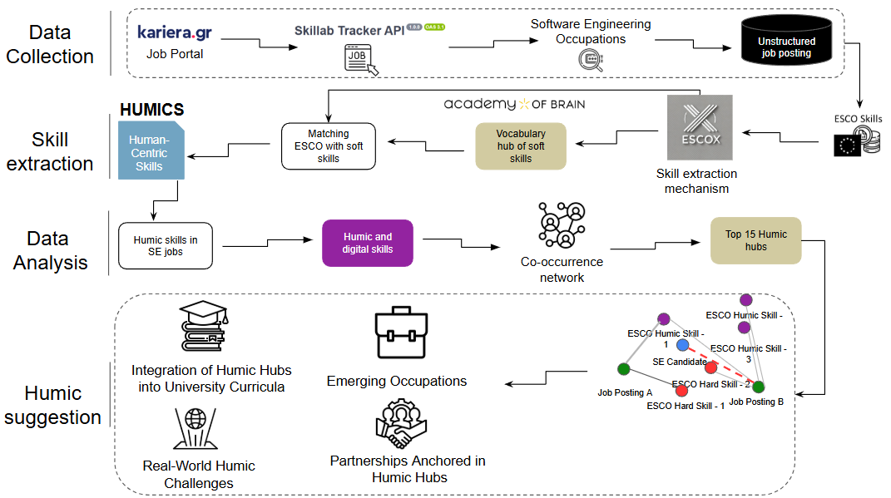
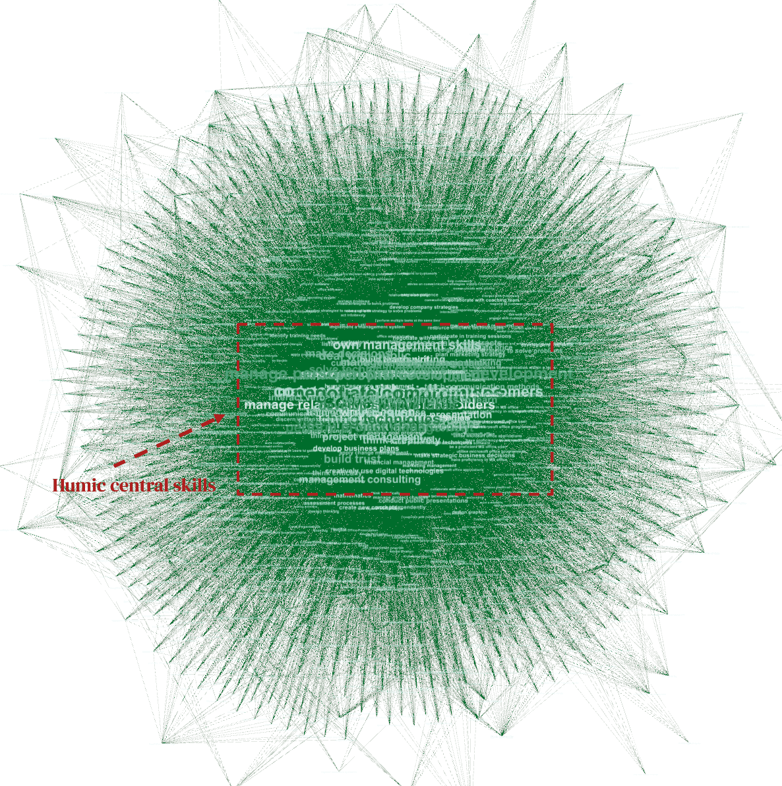
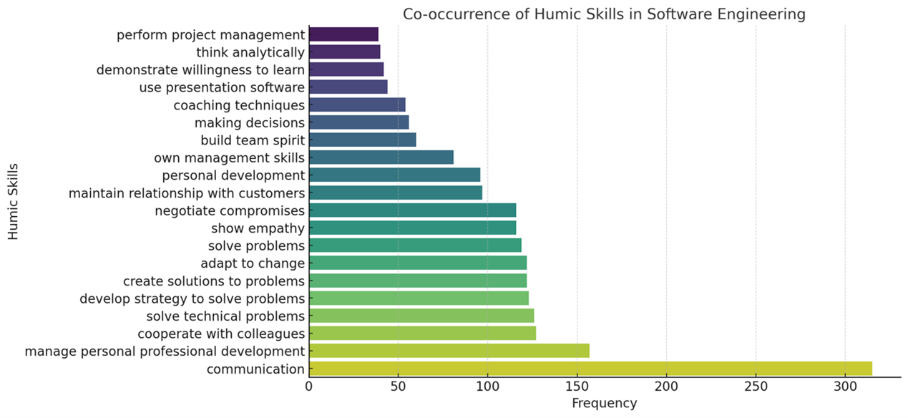
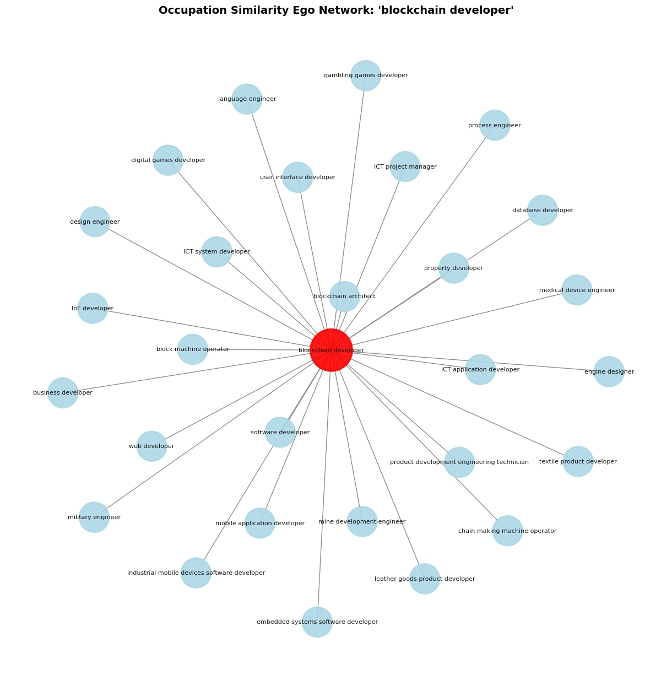
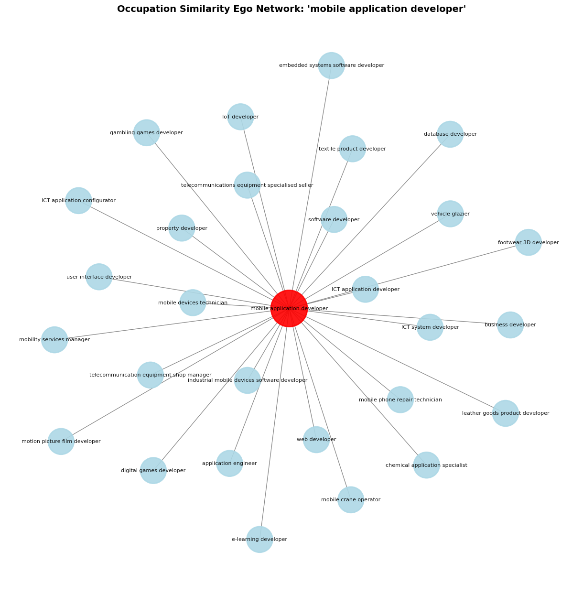
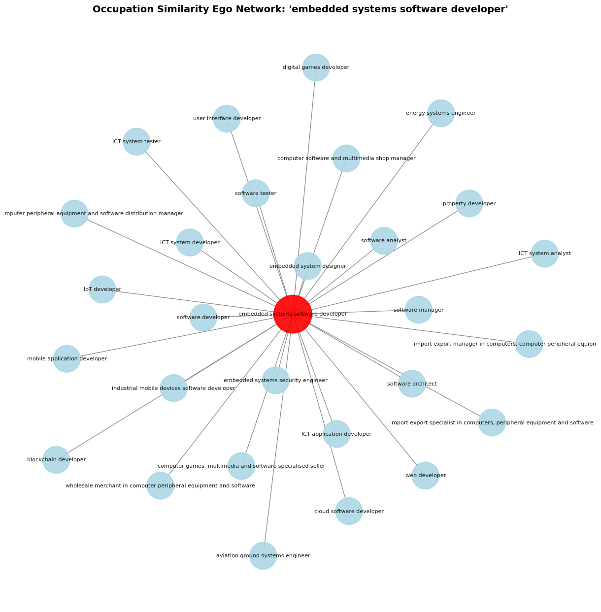
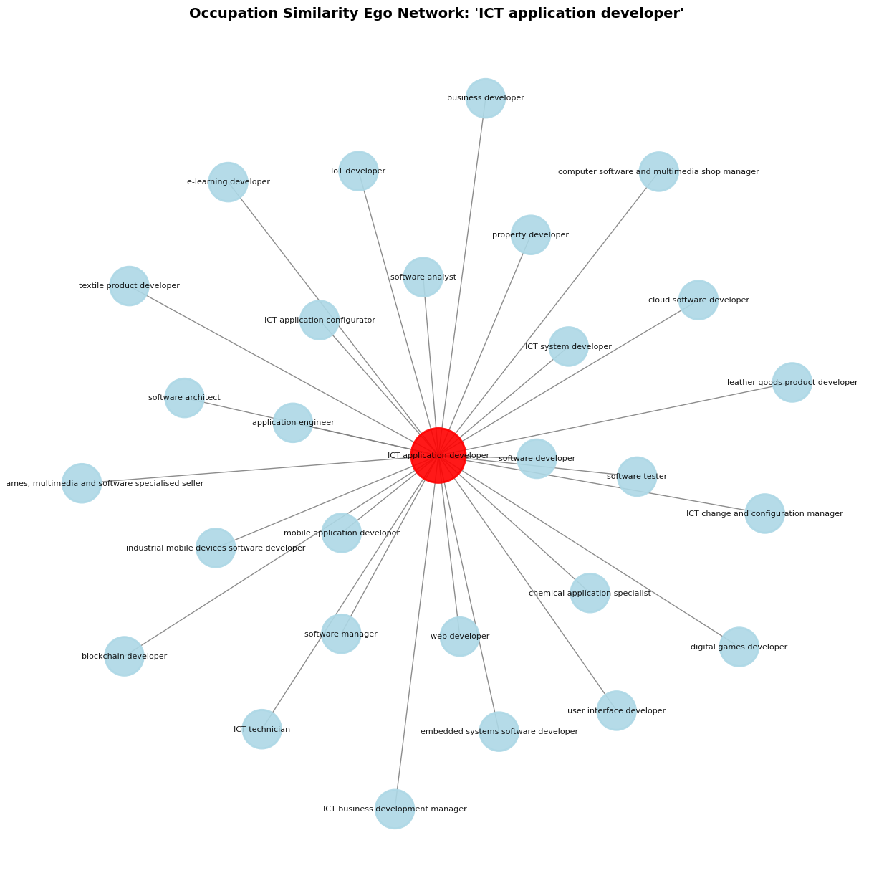

# HUMANE-SE

## Human-centric Software Engineering in the AI Era

HUMANE-SE (Human-centric Mapping and Assessment of Needs and Expertise in Software Engineering) is a research-oriented framework designed to analyze the coexistence of technical and human-centric skills in Software Engineering job markets.

The project investigates how uniquely human skills — referred to as **humics** — remain essential in increasingly automated and AI-driven development environments.

This repository contains the methodology, documentation, and implementation concepts developed as part of an undergraduate thesis at the School of Informatics, Aristotle University of Thessaloniki.

---

## HUMANE-SE Framework

The HUMANE-SE framework combines labor market data collection, ESCO-based skill extraction, semantic similarity mapping, network analysis, and AI-assisted recommendation generation to identify hybrid human-centric Software Engineering skill profiles.

---

## Global Humics Network

The global co-occurrence network illustrates relationships between human-centric and technical skills identified in Software Engineering job postings.

---

## Humics Skills Frequency Analysis

Communication, adaptability, problem-solving, collaboration, and professional development emerged as some of the most frequently requested humics skills.

---

## Occupation Similarity Ego Networks

### Blockchain Developer Network

### Mobile Application Developer Network

### Embedded Systems Network

### ICT Application Developer Network

---

## Humic Skill Explorer

The HUMANE-SE platform includes an interactive humics exploration environment capable of generating job role and learning pathway recommendations using LLM-assisted workflows.

---
## Research Objectives

The main objectives of HUMANE-SE are:

- Identify human-centric skills in Software Engineering job postings
- Analyze the coexistence of humics with technical competencies
- Detect hybrid skill clusters through network analysis
- Generate recommendations for future job roles and learning pathways
- Explore how AI transforms Software Engineering skill requirements

---

## Methodology Overview

The HUMANE-SE framework consists of four major stages:

1. Data Collection
2. Skill Extraction
3. Data Analysis
4. Humics Suggestion

The framework combines:

- ESCO taxonomy
- NLP-based skill extraction
- Semantic similarity mapping
- Co-occurrence network analysis
- Human-in-the-loop validation

---

## Core Concepts

### Humics

Humics are uniquely human skills that remain resistant to automation, including:

- Communication
- Adaptability
- Empathy
- Creativity
- Critical thinking
- Ethical reasoning
- Collaboration

### Humics Hubs

Humics Hubs represent clusters of co-occurring human-centric and technical skills identified through network analysis.

---

## Technologies & Tools

- Python
- ESCO / ESCOX
- NetworkX
- NLP / Transformer-based extraction
- Semantic similarity analysis
- Plotly / Graph visualization
- LLM-assisted recommendations

---

## Thesis Information

- Author: Aristotelis Kalantzis
- Institution: Aristotle University of Thessaloniki
- School: School of Informatics

### Research Areas

- Software Engineering
- AI & Labor Market Analysis
- Human-centric Computing
- Skill Intelligence

---

## Future Work

Future extensions of the framework may include:

- Real-time labor market monitoring
- Multi-taxonomy skill mapping
- Explainable AI integration
- Expanded occupation similarity networks
- Cross-domain humics analysis

---

## License

This project is licensed under the MIT License.
